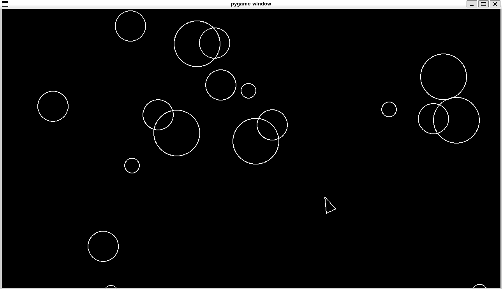

# Asteroids

Python implementation of the classic Asteroids game using pygame library. 



# Requirements:

- Python 3 or above

# Instructions:

1- Install dependencies with:

```bash
pip install -r requirements.txt
```

2- Now you can run the game with: 

```bash
python3 main.py
```

OR

```bash
python main.py
```

Depending on your environment and python version.

# Keyboard support

Move with: WASD

Shoot with: Space Bar